**项目名**： 基于SSM的网络图书管理系统

**技术栈：**

- **前端**：JSP, CSS, JavaScript, Jquery.js
- **后端**：Spring+SpringMvc+MyBatis
- **数据库**：Mysql
- **认证和授权**：Session+Cookie+WebFilter
- **部署**：Tomcat9.0.58、JDK8

**功能模块**：

**前端功能模块**：

1. **用户认证和授权**：提供用户注册、登录、和密码重置功能。用户可以登录并借阅图书以及发表评论。
2. **图书搜索**：允许用户搜索图书，按照关键字、作者、分类等进行筛选，并显示相关图书的详细信息以便用户能够按照各种标准查找图书。
3. **图书列表**：用户可以查看所有图书的列表，按照不同的排序方式（如最新、最热、评分）浏览图书。
4. **图书详情**：用户可以点击图书以查看其详细信息，包括标题、作者、出版日期、描述以及相关评论。
5. **用户图书管理**：用户可以查看图书详情并借阅图书，以及查看自己的归还信息。
6. **评论和推荐**：用户可以为图书撰写评论，并将图书推荐给其他读者。其他用户可以查看评论和推荐以了解其他人的意见。
7. **用户个人资料**：用户可以编辑个人资料，包括用户名、个人信息、密码等。
8. **在线咨询**： 用户可以在线咨询图书管理员相关问题。
9. **图书馆预约**：用户可以发起预约位置信息，提前占位。
10. **借阅图书**：用户可以发起在线预约借阅，然后到图书馆领取借阅书籍时无需二次记录借阅信息。

**后端功能模块**：

1. **读者管理**： 管理读者的注册信息（查看、修改、删除、更新，刷新缓存）并支持一键轻松导入导出所有读者信息。
2. **图书管理**： 管理图书信息，包括查看图书详情、更新图书信息以及图书信息出库与入库。
3. **图书馆管理**：发布公告、发布预约信息并提供相应管理功能。
4. **日志管理**：管理日志信息，包括对所有读者借还日志管理、预约日志管理以及登录系统日志管理。
5. **统计分析**：将图书分类数据、读者男女比列以及周访问量数据制作成可视化视图呈现。
6. **搜索和筛选**： 提供图书搜索功能，以便用户能够按照图书名称精确检索图书。数据存储： 使用Mysql数据库存储图书信息、用户信息、评论和评分数据。
7. **API端点**： 提供RESTful API端点，用于前端与后端之间的通信。
8. **认证和授权**： 实施用户认证和授权，确保只有认证和授权用户才能执行敏感操作。
9. **IM及时通信**：使用Websocket协议实现读者与管理员在线聊天，并采用心跳方案及时感知管理员与读者的在线情况并展示在页面并给予友好的状态提示。

##### 页面展示

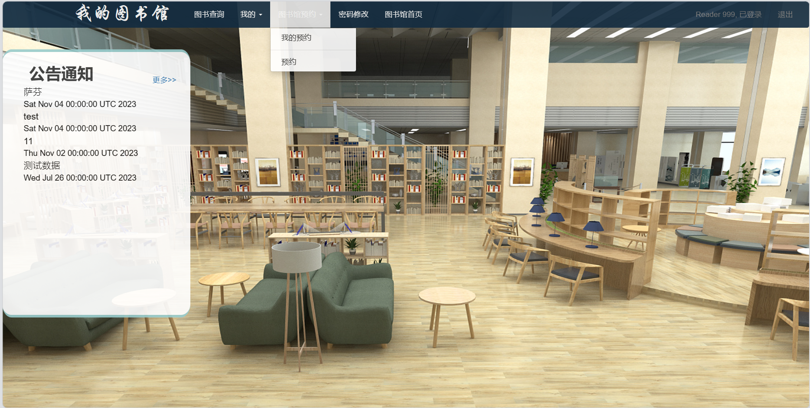
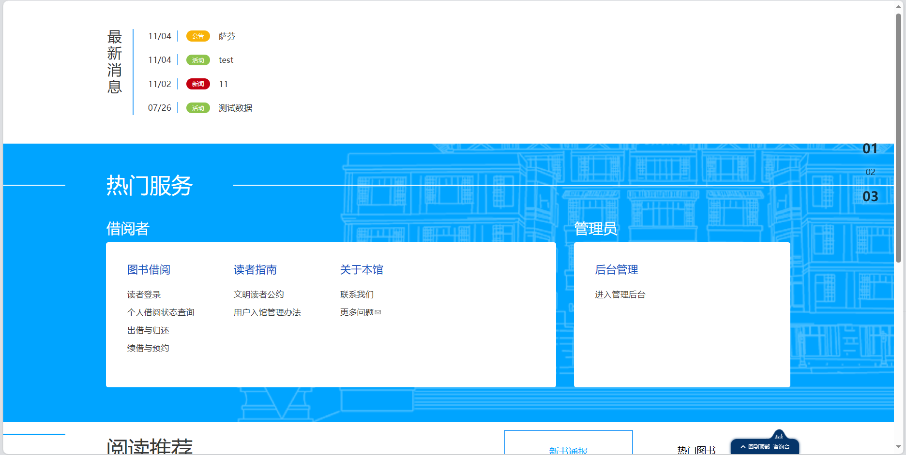
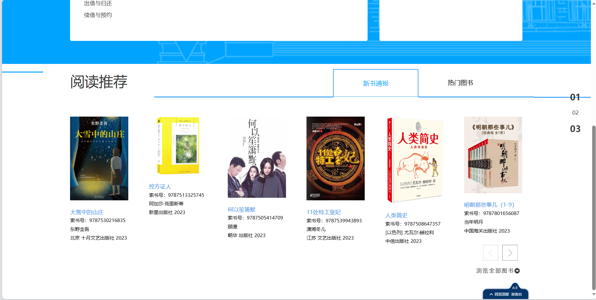
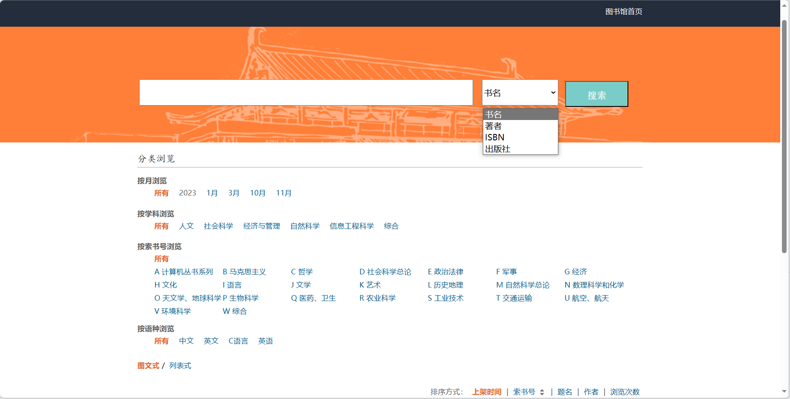
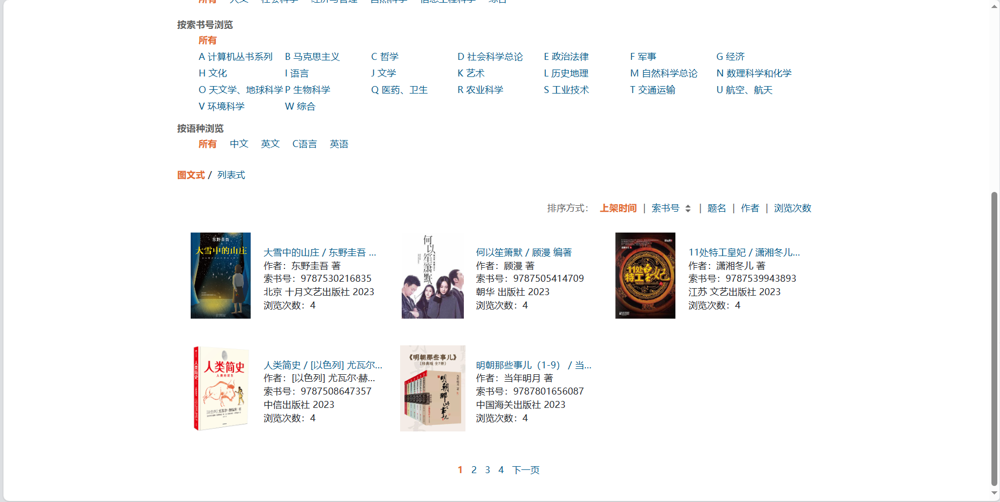
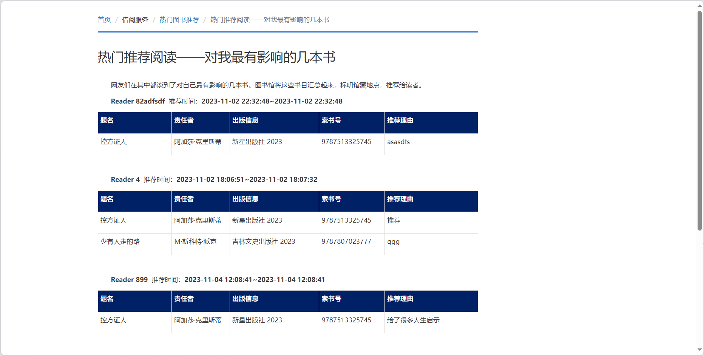
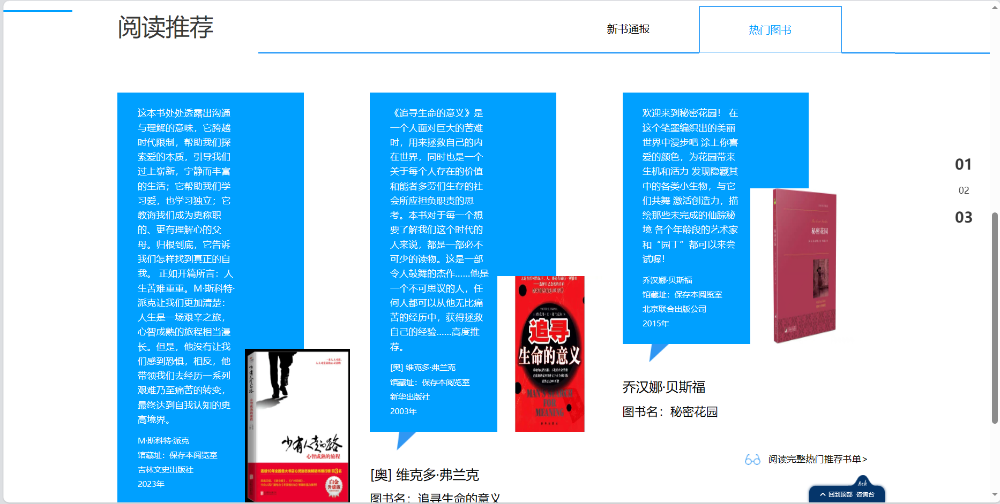
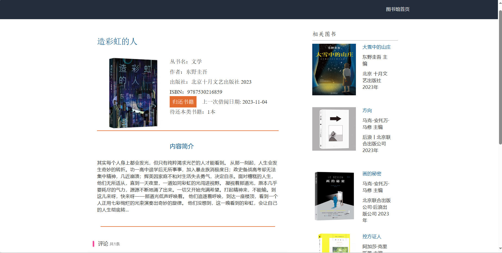

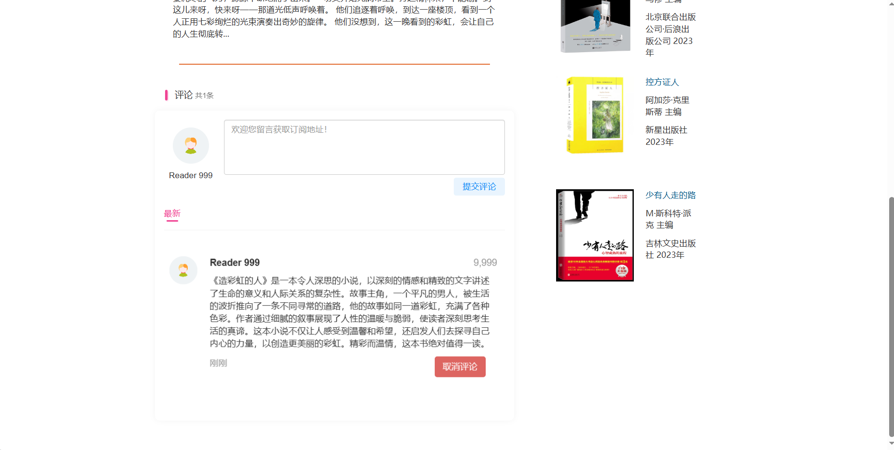
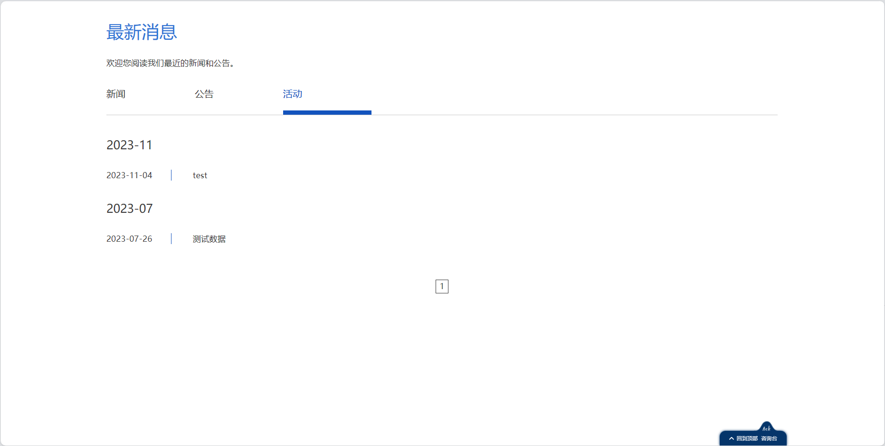
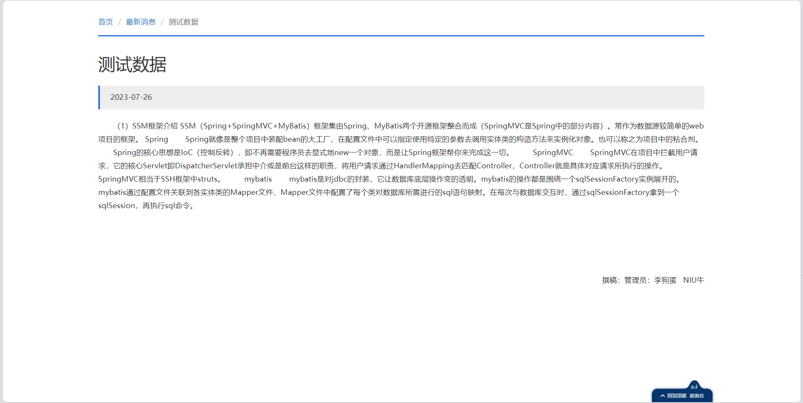

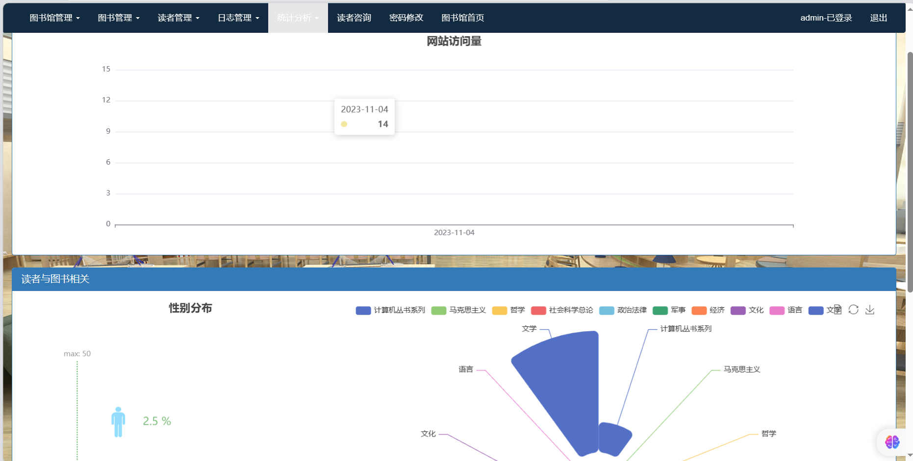
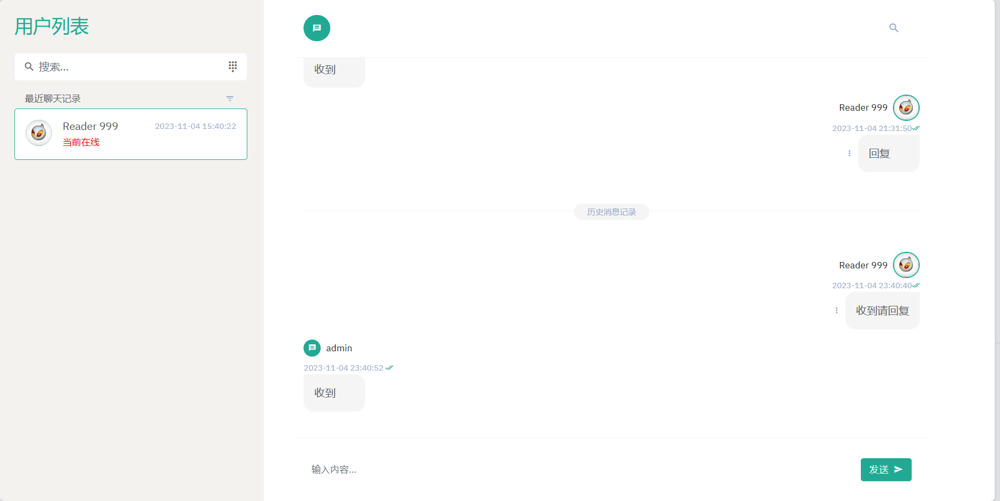
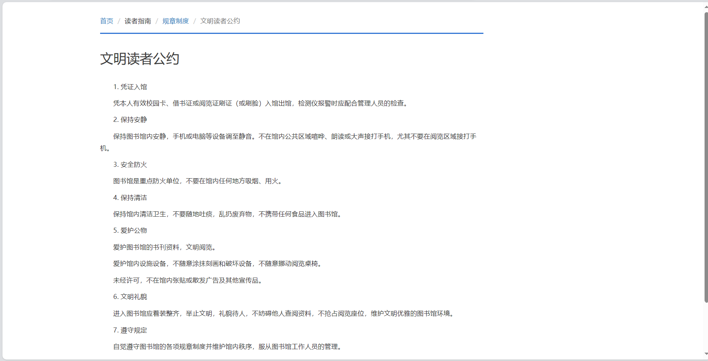
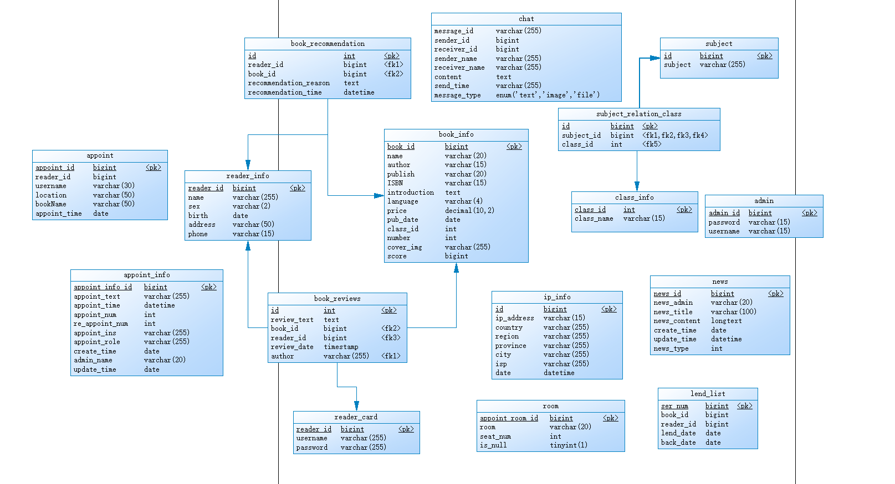

