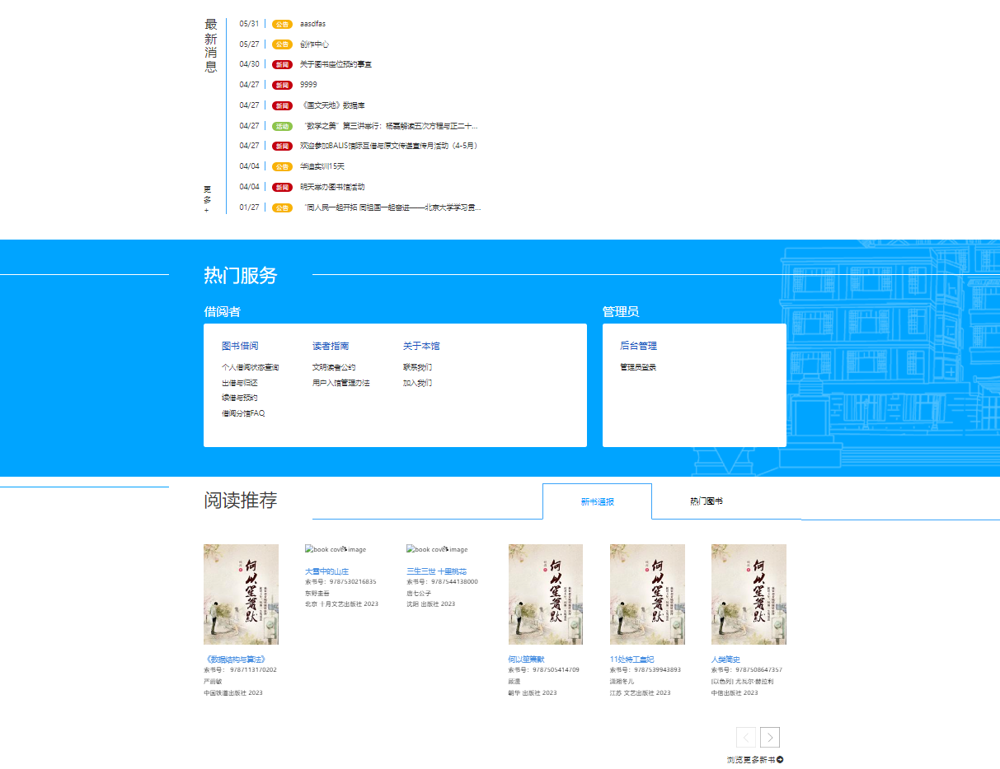
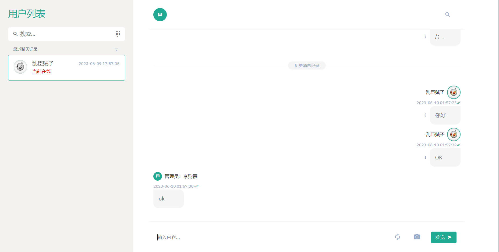
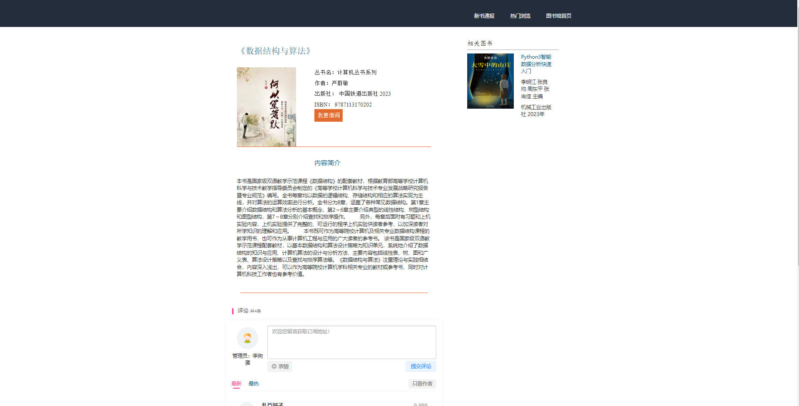
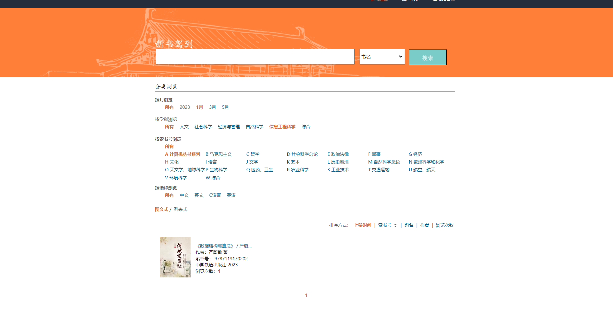
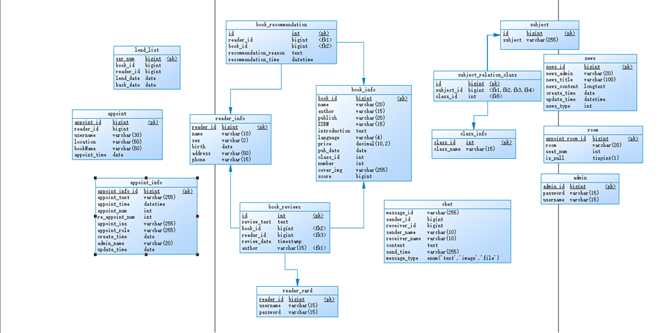

### 图书馆管理系统 ssm+bootstrap

#### 期末作业基于ssm系统展示

**基本功能包括**

预约
注册
管理员发布公告
管理员发布预约信息
读者预约
读者借阅
日志管理

##### 基本功能展示

###### 主页面：

###### 读者咨询页面：

###### 图书详情页面：

###### 图书检索页面：

##### 数据库表结构：

###### 物理模型：

##### 使用环境

tomcat9.0 
jdk8.0 
Maven
项目路径： /

